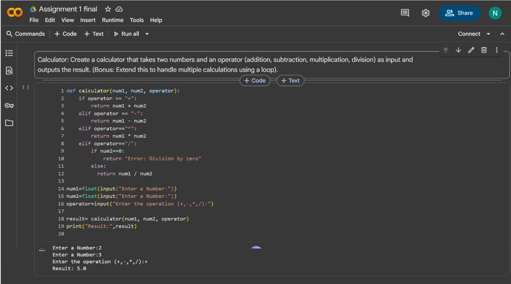
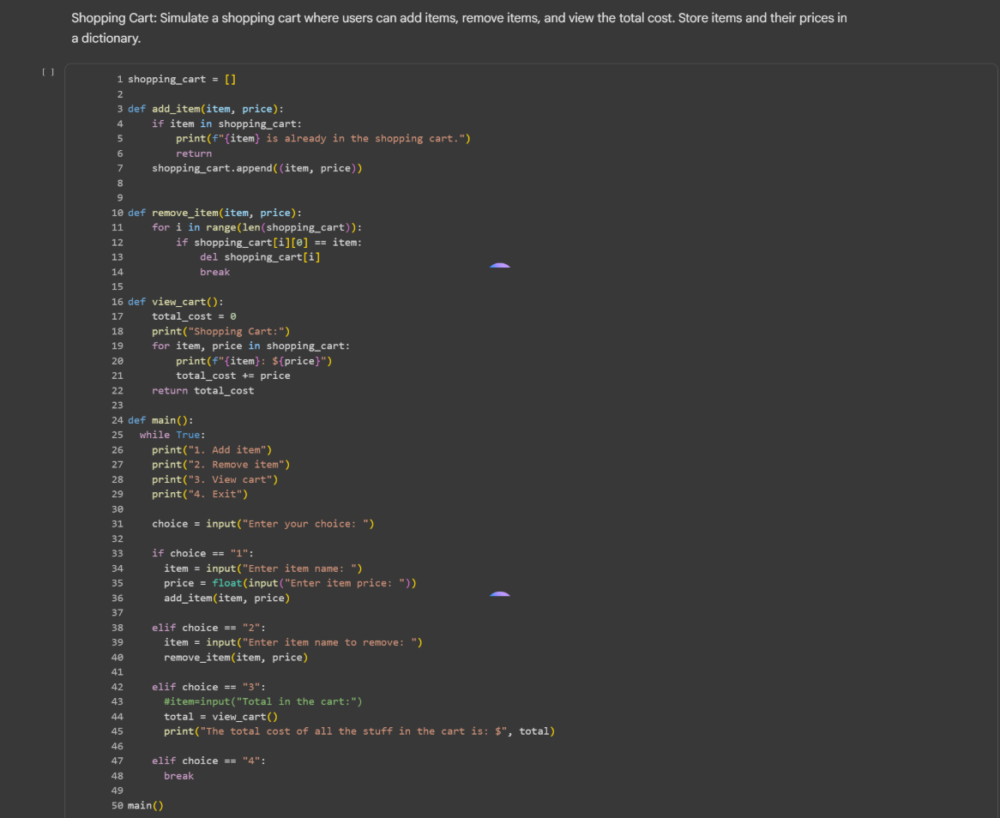

# Natalie Portillo Portfolio



Welcome to the portfolio of **Natalie Portillo**, an Electrical and Computer Engineering Technology student at NJIT. This website showcases my educational journey, projects, technical skills, and ways to connect.

## 🌟 Live Demo
Open `index.html` in your browser or deploy on [GitHub Pages](https://pages.github.com/) for best results.

---

## ✨ Features
- **Modern Responsive Design** – Clean layout and seamless navigation, optimized for all devices.
- **Animated Navigation Bar** – Hamburger menu for mobile and active-link highlighting.
- **Project Gallery** – Project cards with carousels and details, using real Python project screenshots.
- **Skills Showcase** – Grid layout for technical, engineering, and soft skills.
- **Contact Form** – Accessible form with validation and clear error/success messaging.
- **Dark/Light Color Accents** – Modern palette, fine accessibility and motion support.
- **Social & Contact Links** – LinkedIn, GitHub, and direct email contact.

---

## 📁 File Structure
```
C:\...\sdet101\
│   index.html             # Main portfolio webpage
│   portfolio.js           # JavaScript for UI, animation, form validation
│   portfolio.css          # CSS styles for layout, animation, dark/light themes
│   *.png                  # Project and banner images/screenshots
│   README.md              # This file
│   basics.py, debugging.py, hello.py, numbers.py # Python code samples
│   ...
```

---

## 🗂️ Sections Overview
### Home/Hero
- Brief intro and call-to-action linking to Projects

### About
- Education, background, and interests

### Projects
- **Calculator:** Python calculator app
- **Shopping Cart Simulator:** Console-based cart app
- **Currency Exchange Rate Tracker:** API & SQLite-powered data tracker
  
Project screenshots shown in interactive carousels.

### Skills
- Programming languages (Python, JS, HTML/CSS)
- Tools & Tech (SQLite, Google Colab, Git, API)
- Soft Skills (Teamwork, Communication, Time Management)
- Engineering & Core Competencies

### Contact
- Validated contact form for sending a message
- Links to [LinkedIn](https://www.linkedin.com/in/natalie-portillo-4599b438b/) and [GitHub](https://github.com/nmp96-collab)

---

## 🖼️ Screenshots
| Calculator App | Shopping Cart Simulator | Currency Tracker |
| --- | --- | --- |
|  |  |  |

---

## 🚀 Getting Started
1. **Clone or Download:**
   Download all files and images to a single directory.
2. **Open `index.html`:**
   Double-click or open with your browser of choice.
   - Make sure `portfolio.js` and `portfolio.css` and all images are in the same folder.
3. **No Installation Needed:**
   Works fully client-side.

---

## 💡 Technologies Used
- HTML5, CSS3 (custom properties, grid, transitions)
- Modern Vanilla JavaScript (ES6+)
- Google Fonts (Inter)
- Python (project sources)
- SQLite (project screenshots)

---

## 🙏 Credits
- [Natalie Portillo](mailto:nmp96@njit.edu) — Design, development, and content
- Open source icons, Google Fonts, screenshots from original work

---

## 📫 Contact & Social
- **Email:** nmp96@njit.edu
- [LinkedIn](https://www.linkedin.com/in/natalie-portillo-4599b438b/)
- [GitHub](https://github.com/nmp96-collab)

---

© 2025 Natalie Portillo. All rights reserved.
